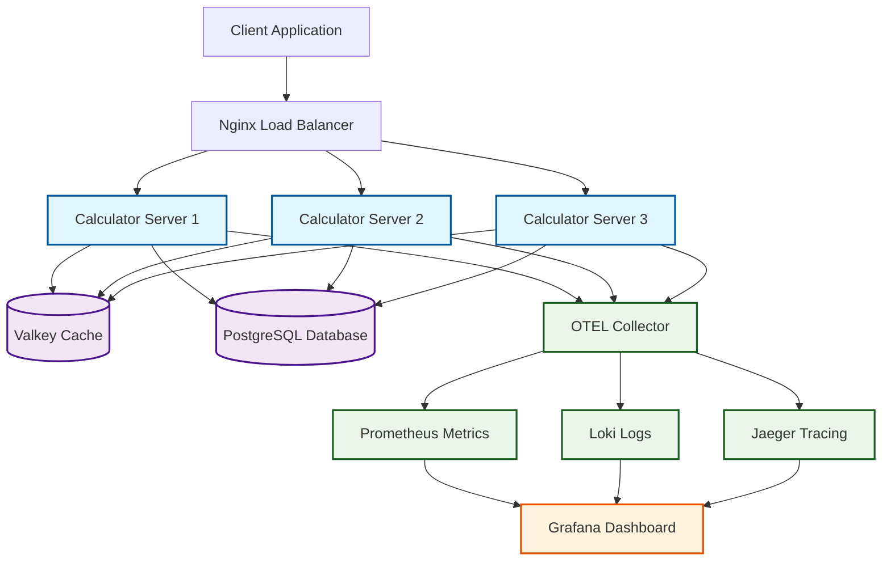

# Calculator OpenTelemetry Project

A comprehensive distributed calculator application demonstrating OpenTelemetry (OTEL) observability implementation with full tracing, metrics, and logging capabilities.

## Table of Contents

- [Overview](#overview)
- [Architecture](#architecture)
- [Features](#features)
- [Technology Stack](#technology-stack)
- [Prerequisites](#prerequisites)
- [Quick Start](#quick-start)
- [Project Structure](#project-structure)
- [Services and Components](#services-and-components)
- [Observability Stack](#observability-stack)
- [API Endpoints](#api-endpoints)
- [Monitoring and Dashboards](#monitoring-and-dashboards)
- [Development](#development)
- [Configuration](#configuration)
- [Troubleshooting](#troubleshooting)
- [OpenTelemetry Resources](#opentelemetry-resources)

## Overview

This project is a learning implementation that demonstrates best practices for building observable microservices using OpenTelemetry. It features a distributed calculator service with comprehensive monitoring, tracing, and logging capabilities.

The application consists of multiple calculator server instances behind a load balancer, with full observability stack including distributed tracing, metrics collection, and centralized logging.

## Architecture



## Features

- **Distributed Calculator Service**: Multiple server instances with load balancing
- **Full OpenTelemetry Integration**: Traces, metrics, and logs
- **Caching Layer**: Valkey (Redis-compatible) for performance optimization
- **Database Integration**: PostgreSQL for persistent data storage
- **Load Balancing**: Nginx with health checks and failover
- **Comprehensive Monitoring**: Grafana dashboards with multiple data sources
- **Distributed Tracing**: Jaeger for trace visualization
- **Metrics Collection**: Prometheus for system and application metrics
- **Centralized Logging**: Loki with Promtail for log aggregation
- **Auto-instrumentation**: OTEL SDK integration for Go applications

## Technology Stack

### Backend

- **Go 1.24.3**: Main programming language
- **OpenTelemetry Go SDK**: Observability instrumentation
- **Valkey**: High-performance caching (Redis-compatible)
- **PostgreSQL**: Primary database

### Infrastructure

- **Docker & Docker Compose**: Containerization and orchestration
- **Nginx**: Load balancer and reverse proxy

### Observability

- **OpenTelemetry Collector**: Telemetry data collection and processing
- **Jaeger**: Distributed tracing backend
- **Prometheus**: Metrics collection and storage
- **Grafana**: Visualization and dashboarding
- **Loki**: Log aggregation system
- **Promtail**: Log shipping agent

## Prerequisites

- Docker and Docker Compose
- Go 1.24.3+ (for local development)
- Make (optional, for using Makefile commands)

## Quick Start

1. **Clone the repository**

   ```bash
   git clone <repository-url>
   cd calculator-otel
   ```

2. **Start all services**

   ```bash
   make up
   # or
   docker compose up -d --build
   ```

3. **Verify services are running**

   ```bash
   make logs
   # or
   docker compose logs -f
   ```

4. **Test the calculator API**

   ```bash
   curl -X POST http://localhost/calculate \
     -H "Content-Type: application/json" \
     -d '{"input1": 10, "input2": 5, "operation": "add"}'
   ```

5. **Access monitoring interfaces**

   - **Grafana**: <http://localhost:3000> (admin/admin)
   - **Jaeger**: <http://localhost:16686>
   - **Prometheus**: <http://localhost:9090>

## Project Structure

```text
calculator-otel/
├── cmd/                          # Application entry points
│   ├── client/                   # Test client application
│   │   └── main.go
│   └── server/                   # Calculator server application
│       └── main.go
├── internal/                     # Private application code
│   ├── app/                      # HTTP handlers and routing
│   │   ├── app.go
│   │   └── models.go
│   ├── cache/                    # Valkey cache implementation
│   │   ├── cache.go
│   │   └── valkey.go
│   ├── logger/                   # Structured logging
│   │   └── logger.go
│   ├── observability/            # OpenTelemetry configuration
│   │   └── otel.go
│   └── service/                  # Business logic
│       ├── operands.go
│       └── service.go
├── monitoring/                   # Monitoring stack configuration
│   ├── grafana/                  # Grafana configuration and dashboards
│   │   └── provisioning/
│   ├── loki/                     # Loki configuration
│   ├── nginx/                    # Load balancer configuration
│   │   └── nginx.conf
│   ├── otel-collector/           # OpenTelemetry Collector config
│   │   └── otel-collector-config.yaml
│   ├── prometheus/               # Prometheus configuration
│   │   └── prometheus.yml
│   └── promtail/                 # Promtail configuration
├── bin/                          # Compiled binaries
├── docker-compose.yml            # Service orchestration
├── Dockerfile.server             # Server container image
├── Makefile                      # Build and deployment commands
├── go.mod                        # Go module dependencies
└── go.sum                        # Go module checksums
```

## Services and Components

### Calculator Server

- **Port**: 8080 (internal), 80 (via nginx)
- **Instances**: 3 replicas for high availability
- **Features**: Basic arithmetic operations (add, subtract, multiply, divide)
- **Caching**: Results cached in Valkey for performance
- **Database**: Operation history stored in PostgreSQL

### Load Balancer (Nginx)

- **Algorithm**: Least connections
- **Health Checks**: Automatic failover on server failure
- **Trace Propagation**: Forwards OpenTelemetry trace headers

### Cache Layer (Valkey)

- **Port**: 6379
- **Purpose**: Cache calculation results
- **Integration**: Native OpenTelemetry instrumentation

### Database (PostgreSQL)

- **Port**: 5432
- **Database**: calculator
- **Purpose**: Store calculation history and audit logs

## Observability Stack

### OpenTelemetry Collector

- **Receives**: OTLP traces and logs from applications
- **Processes**: Batching and enrichment
- **Exports**: To Jaeger (traces) and Loki (logs)

### Jaeger (Distributed Tracing)

- **UI**: <http://localhost:16686>
- **Features**: Trace visualization, service dependency mapping
- **Data Retention**: Configurable trace storage

### Prometheus (Metrics)

- **UI**: <http://localhost:9090>
- **Metrics**: System and application metrics
- **Targets**: All containerized services

### Grafana (Visualization)

- **UI**: <http://localhost:3000>
- **Credentials**: admin/admin
- **Data Sources**: Prometheus, Loki, Jaeger
- **Dashboards**: Pre-configured for all services

### Loki & Promtail (Logging)

- **Loki**: Log aggregation backend
- **Promtail**: Log collection agent
- **Integration**: Structured logging with trace correlation

## API Endpoints

### Calculator Service

| Method | Endpoint | Description | Request Body |
|--------|----------|-------------|--------------|
| GET | `/ping` | Health check | - |
| POST | `/ping` | Health check | - |
| POST | `/calculate` | Perform calculation | `{"input1": int, "input2": int, "operation": string}` |

#### Supported Operations

- `add`: Addition
- `subtract`: Subtraction
- `multiply`: Multiplication
- `divide`: Division

#### Example Request

```bash
curl -X POST http://localhost/calculate \
  -H "Content-Type: application/json" \
  -d '{"input1": 15, "input2": 3, "operation": "divide"}'
```

#### Example Response

```json
{
  "result": 5,
  "input1": 15,
  "input2": 3,
  "operation": "divide"
}
```

## Monitoring and Dashboards

### Grafana Dashboards

Access Grafana at <http://localhost:3000> with credentials `admin/admin`:

1. **Application Overview**: High-level service metrics
2. **Infrastructure Monitoring**: Container and system metrics
3. **Request Tracing**: Distributed trace visualization
4. **Error Analysis**: Error rates and patterns
5. **Performance Metrics**: Latency and throughput analysis

### Key Metrics to Monitor

- Request rate and latency
- Error rate by operation
- Cache hit/miss ratio
- Database connection pool status
- Service instance health

## Development

### Local Development Setup

1. **Install dependencies**

   ```bash
   go mod tidy
   ```

2. **Build applications**

   ```bash
   make build-all
   # or individually
   make build-server
   make build-client
   ```

3. **Run tests**

   ```bash
   go test ./...
   ```

### Available Make Commands

```bash
make build-all      # Build both server and client
make build-server   # Build only server
make build-client   # Build only client
make clean          # Remove build artifacts
make up             # Start all services
make down           # Stop and remove all services
make logs           # Follow service logs
```

### Adding New Features

1. Implement business logic in `internal/service/`
2. Add HTTP handlers in `internal/app/`
3. Update API documentation
4. Add appropriate tests
5. Verify observability integration

## Configuration

### Environment Variables

| Variable | Default | Description |
|----------|---------|-------------|
| `OTEL_EXPORTER_OTLP_ENDPOINT` | `http://otel-collector:4317` | OTLP collector endpoint |
| `OTEL_RESOURCE_ATTRIBUTES` | `service.instance.id=calculator-server-*` | Service identification |
| `POSTGRES_USER` | `postgres` | Database username |
| `POSTGRES_PASSWORD` | `postgres` | Database password |
| `POSTGRES_DB` | `calculator` | Database name |

### Service Configuration

- **Server Port**: Configured in server main.go (default: 8080)
- **Cache TTL**: Configurable in cache implementation
- **Load Balancer**: Configure in `monitoring/nginx/nginx.conf`
- **Observability**: Configure in `monitoring/otel-collector/otel-collector-config.yaml`

## Troubleshooting

### Common Issues

1. **Services not starting**

   ```bash
   docker compose down -v
   docker compose up -d --build
   ```

2. **Traces not appearing in Jaeger**
   - Check OTEL Collector logs: `docker compose logs otel-collector`
   - Verify endpoint configuration in environment variables

3. **Database connection issues**
   - Ensure PostgreSQL is running: `docker compose ps postgres`
   - Check database logs: `docker compose logs postgres`

4. **Cache not working**
   - Verify Valkey status: `docker compose ps valkey`
   - Check cache integration in application logs

### OpenTelemetry Metrics Upload Error

If you see an error like:

```
failed to upload metrics: rpc error: code = Unimplemented desc = unknown service opentelemetry.proto.collector.metrics.v1.MetricsService
```

This means the OpenTelemetry Collector endpoint does not support the OTLP metrics gRPC service. To resolve:

1. **Collector Version**: Ensure you are running a recent OpenTelemetry Collector (v0.60.0+ recommended).
2. **Collector Config**: Make sure your `otel-collector-config.yaml` includes:

   ```yaml
   receivers:
     otlp:
       protocols:
         grpc:
         http:
   service:
     pipelines:
       metrics:
         receivers: [otlp]
         exporters: [prometheus]
   ```

3. **Restart the Collector** after any config changes.
4. **Check Application Endpoint**: Ensure your app is sending metrics to the correct collector endpoint (default: `localhost:4317`).

If you are using the provided configuration, metrics should be enabled by default. If you still encounter issues, check the collector logs for more details.

### Debugging

- **Application logs**: `docker compose logs calculator-server-1`
- **All service logs**: `docker compose logs -f`
- **Specific service**: `docker compose logs -f <service-name>`

### Performance Tuning

- Adjust OTEL Collector batch size in configuration
- Configure Valkey memory limits
- Optimize PostgreSQL connection pooling
- Tune Nginx worker processes

## OpenTelemetry Resources

### Documentation

- [What is OpenTelemetry?](https://opentelemetry.io/docs/what-is-opentelemetry/)
- [Getting Started](https://opentelemetry.io/docs/getting-started/)
- [OpenTelemetry Concepts](https://opentelemetry.io/docs/concepts/)
- [Go Language SDK](https://opentelemetry.io/docs/languages/go/)
- [OpenTelemetry Collector](https://opentelemetry.io/docs/collector/)

### Key Concepts Demonstrated

- **Spans**: Individual operations with timing and metadata
- **Traces**: Complete request journeys across services
- **Metrics**: Quantitative measurements of system behavior
- **Logs**: Structured event records with trace correlation
- **Context Propagation**: Trace context across service boundaries
- **Auto-instrumentation**: Automatic observability for common libraries

---

This project serves as a comprehensive example of building observable microservices with OpenTelemetry, demonstrating real-world patterns for monitoring, tracing, and debugging distributed systems.
